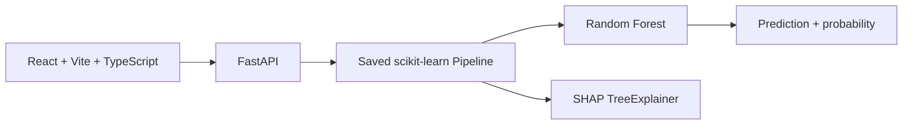

# TrustLoan AI

TrustLoan AI is an academic loan eligibility application that connects the existing React/Vite interface to the saved scikit-learn Random Forest pipeline.

## Current architecture



The deployed artifact is `models/v2/loan_eligibility_model_v2.pkl`. Its preprocessing is reused unchanged. Raw feature values are passed to the pipeline; preprocessing is not recreated in the API.

## Backend

From the repository root:

```powershell
C:\Users\RUPES\AppData\Local\Programs\Python\Python311\python.exe -m pip install -r Backend/requirements.txt
Set-Location Backend
python -m uvicorn main:app --reload --port 8000
```

Endpoints:

- `GET /`
- `GET /health`
- `POST /api/predict`
- `GET /api/insights`
- `POST /api/nlp/extract`
- `POST /api/shap`
- `POST /api/whatif`
- `POST /api/advisor`
- `POST /api/report`

`POST /api/predict` validates the eleven model features, returns the saved model prediction and approval probability, and includes approved-class SHAP contributions when SHAP is available.

`POST /api/nlp/extract` only extracts values explicitly identified in user text. Unknown fields remain `null` and are listed in `missing_required_fields`; extraction never makes a prediction. Complete, user-reviewed fields are then sent to `/api/predict`.

`POST /api/advisor` is an optional Gemini explanation layer. It receives the Random Forest result and SHAP evidence, never makes the approval decision, and returns `AI Advisor is not configured.` when `GEMINI_API_KEY` is absent. Configure the provider with `GEMINI_API_KEY` and `GEMINI_MODEL`; credentials are read server-side.

`POST /api/report` returns a real PDF containing the applicant inputs, model classification, probability, risk score, SHAP factors, and responsible-AI disclaimer.

## Frontend

```powershell
Set-Location Frontend
npm install
npm run dev
```

The client uses `http://127.0.0.1:8000` by default. Set `VITE_API_BASE_URL` to override it.

## Validation

```powershell
Set-Location Backend
python -m pytest tests/test_api.py tests/test_results.py -q
Set-Location ../Frontend
npm run build
```

## Model facts

The deployed model is a tuned Random Forest. Reported held-out test-set metrics are 98.13% accuracy, 98.14% precision, 98.13% recall, 98.12% F1, and 99.83% ROC-AUC. These are dataset test results, not real-world guarantees. The input CIBIL value is not generated by TrustLoan AI, and the TrustLoan Model Risk Score is a transparent probability-derived application score, not an official banking or credit-bureau score.

The model represents `loan_term` in years, matching the original training convention. SHAP values describe model contribution relative to a baseline and are not causal evidence.

## Current limitations

The saved model prediction, probability, SHAP explanation, What-If endpoint, artifact-backed Insights page, nullable NLP extraction, optional Gemini Advisor endpoint, and PDF report are implemented. NLP requires user completion of fields that were not present in the text. The Gemini advisor remains unavailable until a server-side provider is configured using `.env.example`; it does not make approval decisions. There is no bank policy integration or external validation.
